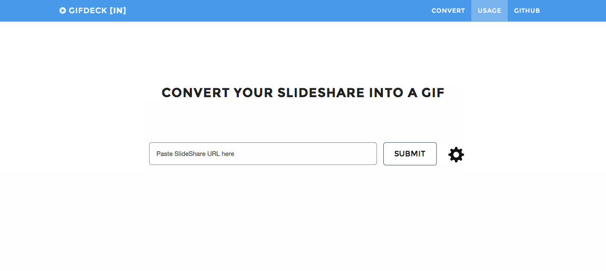

GifDeck
=======
Convert your SlideShares into beautifully animated GIFs

http://gifdeck.in

GifDeck uses [gif.js](http://jnordberg.github.io/gif.js/) to convert a presentation into a playable GIF. It makes use of HTML5 Canvas, Blob and Web Workers. Everything happens on the client side. Individual slides of a presentation are fetched using [SlideShare oEmbed API](http://www.slideshare.net/developers/oembed). For bypassing the cross browser restrictions, it uses an iFrame based postMessage proxy.